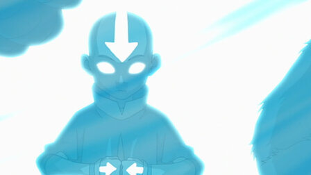

# jskrobot.github.io

 # AVATAR [^1]

Water. Earth. Fire. Air.

A long time ago, four nations lived together in harmony. Then everything changed when the Nation of Fire attacked. Only the Avatar, the master of all four elements, could stop them, but when the world needed him most, he disappeared.

## Seasons of the Avatar: The Last Airbender [^2]
|season|name of season|
|:---------:|:---------:|
|1 |Book One: Water|
|2  |Book Two: Earth|
|3  |Book Three: Fire|

[^1]: 1
[^2]: 2

